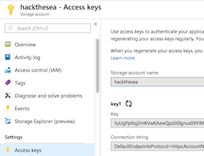
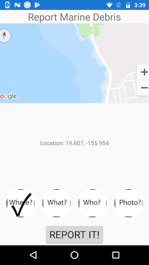

# Marine Debris Reporting: Hack the Sea Honolulu

This Marine Debris Reporting app is a functional mobile application that runs on
both Android and iOS devices and uploads reports of marine debris to the Azure 
cloud. The backend is globally scalable. For the weekend, I just posted the data
directly to storage without an intervening Web app:

The app itself has, at the moment, five data-entry pages: Location, Debris Type, Debris Weight, Hitchhikers (Biota), and Notes (including weight and whether the debris was picked up / brought onboard). The data types were taken from NOAA's Pacific Island Regional Office Observer Program, supplemented with photo
data and geolocation based on the phone's GPS. 

All of the art is placeholder art. 

## Basic Functionality

The app has a header, a content area, and a footer. The content area is a carousel of data-entry pages that the user can swipe back and forth to enter data, take pictures, get a GPS fix, etc. 

The footer contains a "progress panel" that shows the commpletion status of the report as a whole.  

The UI of the data-entry pages reveals how terrible I am at UX! Each page shows a different approach: strict grids, flow layout, and picker and textfield pages. Obviously, a person with a decent sense of design should weigh in and one
of the techniques chosen. 

## Technical 

The app was written using Microsoft's Xamarin technology, in F#, using the [Fabulous](https://fsprojects.github.io/Fabulous/index.html
) framework. I ended up porting two controls (the `CircleImage` and the `CarouselView`) to Fabulous and I'll be contributing that code back to the Fabulous 
project. The rest of the code is licensed under the MIT license. 

